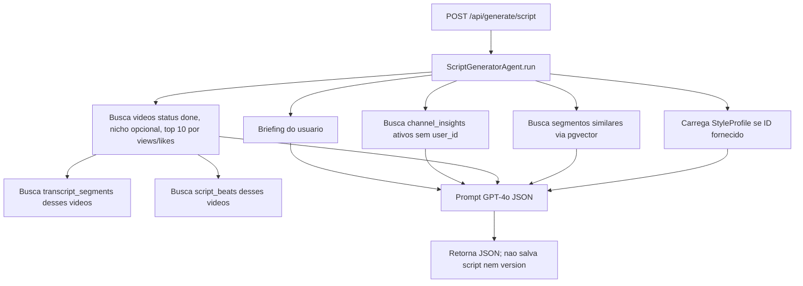
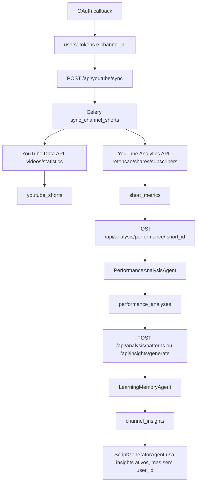
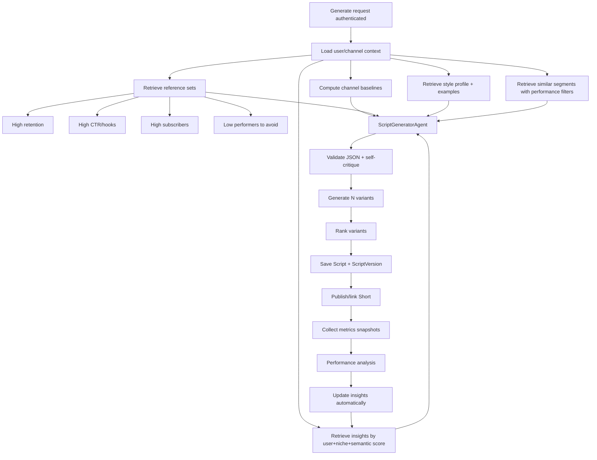

# AI Pipeline Audit for ChatGPT

## 1. Executive Summary

O backend tem as pecas principais de um ciclo de IA para Shorts: upload/transcricao/analise/embedding de videos (`app/tasks/video_tasks.py`), geracao de roteiros (`app/agents/script_generator_agent.py`), integracao YouTube/OAuth (`app/api/routers/auth.py`, `app/tasks/youtube_tasks.py`), metricas (`short_metrics`), analise de performance (`PerformanceAnalysisAgent`), memoria (`LearningMemoryAgent`) e sugestoes (`ChannelStrategyAgent`).

Mas o ciclo fechado ainda esta parcialmente quebrado no codigo real. A geracao de roteiro usa apenas videos da tabela `videos`, segmentos transcritos, alguns beats, insights ativos e um `StyleProfile` opcional. Ela nao usa diretamente `youtube_shorts`, `short_metrics`, `performance_analyses`, `video_suggestions`, historico de metricas, script versions anteriores, comentarios, CTR/retencao por decisao, ou score composto de performance. Tambem ha riscos fortes de multiusuario: `/api/generate/script`, `/api/generate/from-suggestion/{id}` e a busca semantica nao exigem usuario; `ScriptGeneratorAgent._build_insights_context()` nao filtra por `user_id`; e `videos` nao tem `user_id`.

Teste executado: `pytest -q` no backend. Resultado: falha antes de coletar testes porque `Settings.DEBUG` recebeu `release` e o Pydantic nao interpreta isso como booleano (`app/core/config.py:9`, `app/db/session.py:16`).

## 2. Current Real Flow

### Endpoints e agentes

| Endpoint | Arquivo | Agent/task chamado | Sincrono? | Salva dados? |
|---|---|---|---|---|
| `POST /api/videos/upload` | `app/api/routers/videos.py:84` | `process_video_upload` | Async Celery | cria `videos`; task salva segmentos/beats/embeddings |
| `POST /api/videos/text` | `app/api/routers/videos.py:121` | `process_video_text` | Async Celery | idem |
| `POST /api/videos/url` | `app/api/routers/videos.py:143` | `process_video_url` | Async Celery | idem, com metadados de views/likes via `yt_dlp` |
| `GET /api/search` | `app/api/routers/search.py:26` | OpenAI embeddings direto | Sincrono | nao |
| `POST /api/styles/generate` | `app/api/routers/styles.py:126` | `generate_style_profile` | Async Celery | salva `style_profiles` |
| `POST /api/generate/script` | `app/api/routers/generate.py:42` | `ScriptGeneratorAgent.run()` | Sincrono | nao salva roteiro |
| `POST /api/generate/improve` | `app/api/routers/generate.py:65` | `RetentionCriticAgent.run()` | Sincrono | nao salva versao |
| `POST /api/generate/hooks` | `app/api/routers/generate.py:88` | GPT direto | Sincrono | nao |
| `POST /api/generate/from-suggestion/{id}` | `app/api/routers/generate.py:122` | `ScriptGeneratorAgent.run()` | Sincrono | nao salva |
| `POST /api/scripts` | `app/api/routers/scripts.py:24` | nenhum agent | Sincrono | salva script + version 1 |
| `POST /api/scripts/{id}/versions` | `app/api/routers/scripts.py:174` | nenhum agent | Sincrono | salva nova versao |
| `GET /api/auth/youtube/connect` | `app/api/routers/auth.py:107` | OAuth URL | Sincrono | nao |
| `GET /api/auth/youtube/callback` | `app/api/routers/auth.py:131` | Google token/channel APIs | Sincrono | salva tokens/canal no `users` |
| `POST /api/youtube/sync` | `app/api/routers/youtube.py:31` | `sync_channel_shorts` | Async Celery | salva shorts + metricas |
| `POST /api/youtube/shorts/{id}/fetch-metrics` | `app/api/routers/youtube.py:79` | `fetch_short_metrics` | Async Celery | salva metricas + history |
| `POST /api/youtube/shorts/{id}/fetch-transcript` | `app/api/routers/youtube.py:96` | `fetch_short_transcript` | Async Celery | salva transcript plano no short |
| `POST /api/youtube/metrics/manual` | `app/api/routers/youtube.py:155` | nenhum agent | Sincrono | salva `short_metrics` e history |
| `POST /api/analysis/performance/{short_id}` | `app/api/routers/analysis.py:18` | `analyze_short_performance` | Async Celery | salva `performance_analyses` |
| `POST /api/analysis/channel` | `app/api/routers/analysis.py:64` | `analyze_channel` | Async Celery | salva `video_suggestions` |
| `POST /api/analysis/patterns` | `app/api/routers/analysis.py:73` | `generate_insights` | Async Celery | salva/atualiza `channel_insights` |
| `POST /api/insights/generate` | `app/api/routers/insights.py:91` | `generate_insights` | Async Celery | salva/atualiza `channel_insights` |
| `POST /api/suggestions/generate` | `app/api/routers/suggestions.py:47` | `generate_suggestions` | Async Celery | salva `video_suggestions` |
| `POST /api/suggestions/{id}/convert` | `app/api/routers/suggestions.py:76` | nenhum agent | Sincrono | cria script com estrutura sugerida |

### Upload/analise/embedding real

```mermaid
flowchart TD
    A[POST /api/videos/upload|text|url] --> B[Cria Video pending]
    B --> C[Celery video_tasks]
    C --> D[TranscriptionAgent: Whisper ou texto]
    D --> E[Salva transcript_segments]
    E --> F[AnalysisAgent: beats e tecnicas]
    F --> G[Salva script_beats e segment_techniques]
    G --> H[text-embedding-3-small]
    H --> I[Salva embedding 1536d em transcript_segments]
    I --> J[Video status done]
```

Evidencia: `process_video_upload/text/url` em `app/tasks/video_tasks.py:34-53`; `_save_segments_and_analyze()` em `app/tasks/video_tasks.py:165`; `_generate_embeddings()` em `app/tasks/video_tasks.py:245`.

### Geracao de roteiro real



Evidencia: endpoint em `app/api/routers/generate.py:42`; agent em `app/agents/script_generator_agent.py:66`; busca de videos em `script_generator_agent.py:140`; similaridade em `script_generator_agent.py:237`; insights em `script_generator_agent.py:263`.

### YouTube/performance/aprendizado real



Evidencia: OAuth em `app/api/routers/auth.py:107-194`; sync em `app/tasks/youtube_tasks.py:160`; metricas em `youtube_tasks.py:85` e `youtube_tasks.py:134`; performance em `analysis_tasks.py:28`; insights em `analysis_tasks.py:245`.

## 3. Data Inventory

| Dado/Tabela | Campos importantes | Onde nasce | Onde e usado | Entra no roteiro? | Gap |
|---|---|---|---|---|---|
| `videos` | `title`, `source_type`, `duration_seconds`, `view_count`, `like_count`, `creator_name`, `niche`, `status` | upload/text/url em `videos.py:84-181`; URL atualiza views/likes em `video_tasks.py:68` | listagem, detalhes, style, geracao | Sim, top 10 por views/likes | Sem `user_id`; views/likes isolados; nao usa retencao |
| `transcript_segments` | `start_time`, `end_time`, `text`, `word_count`, `position_percent`, `embedding` | `_save_segments_and_analyze()` e `_generate_embeddings()` | search, geracao, video detail | Sim | Usado como amostra textual; nao ranqueia por performance/tecnica |
| `script_beats` | `beat_type`, `attention_goal`, `curiosity_question`, `retention_function`, `emotion`, `intensity_score` | `AnalysisAgent` via `video_tasks.py:194-211` | video detail, dashboard, hooks no generator | Parcial | Na geracao so identifica segmentos hook; ignora intensidade, emotion e curiosity |
| `segment_techniques` | `technique_id`, `confidence`, `evidence` | `video_tasks.py:213-222` | video segment detail | Nao | Tecnicas salvas nao entram no prompt de geracao |
| `techniques` | `name`, `description` | `_get_or_create_technique()` | segment detail | Nao | Poderia alimentar biblioteca de tecnicas vencedoras |
| `style_profiles` | `tone`, `pacing`, `common_hooks`, `common_ctas`, `narrative_patterns`, `do_rules`, `avoid_rules` | style tasks | hooks e roteiro se `style_profile_id` | Parcial | Geracao usa tone/pacing/hooks/do/avoid, mas ignora `common_ctas`, `narrative_patterns`, `avg_sentence_length` |
| `style_videos` | associacao profile-video | migration `e148c9...` | style profile | Indireto | Geracao nao usa os videos do profile explicitamente |
| `users` | auth + YouTube tokens/canal | auth register/OAuth | rotas protegidas e YouTube tasks | Nao | Generator nao recebe usuario |
| `scripts` | `user_id`, `current_version_id`, `status`, `youtube_video_id` | scripts router ou suggestion convert | CRUD/versionamento/performance association | Nao na geracao | Historico nao retroalimenta novos roteiros |
| `script_versions` | `lines`, `analysis`, `generation_params`, `created_by` | scripts router | detalhe/comparacao/performance se short ligado | Nao | Versoes nao sao usadas como memoria, nem avaliadas |
| `youtube_shorts` | `user_id`, `youtube_video_id`, `title`, `description`, `duration`, `tags`, `transcript`, `script_id` | YouTube sync/transcript | YouTube pages, analysis tasks, suggestions | Nao direto | Transcripts de shorts do canal nao entram no generator |
| `short_metrics` | views, likes, comments, shares, subscribers, retention, CTR, engagement | sync/fetch/manual | performance/channel analysis | Nao direto | Principal dado de performance nao entra na geracao |
| `short_metrics_history` | views/likes/comments over time | fetch/manual metrics | history endpoint | Nao | Nao usa velocidade, idade ou maturidade do video |
| `performance_analyses` | dimension scores, strengths, weaknesses, learnings, script_correlation | `analyze_short_performance` | get performance, memory agent | Indireto via insights | Nao entra direto; depende de job manual de insights |
| `channel_insights` | category, sentiment, evidence, niche/theme, confidence, embedding | `generate_insights` | insights UI, generator | Sim | Generator nao filtra por user e nao usa embedding/semantic relevance |
| `video_suggestions` | title, justification, category, based_on_shorts, based_on_insights | channel analysis/suggestions | list/convert/from-suggestion | Parcial | `from-suggestion` ignora owner e based_on_*; convert nao gera roteiro completo |

## 4. Data Actually Used in Script Generation

Hoje `ScriptGeneratorAgent.run()` usa exatamente:

- Briefing do request: `theme`, `duration`, `platform`, `idea`, `niche`, `goal`, `hook_type`, `aggressiveness`, `cta` (`app/agents/script_generator_agent.py:66-114`).
- `channel_insights`: ativos, filtrados por `niche` ou `NULL`, ordenados por `confidence`, limite 10 (`script_generator_agent.py:263-295`). Nao filtra por `user_id`, nao usa `theme` e nao usa embedding.
- `videos`: `status == "done"`, `niche` opcional, ordenados por `view_count`, `like_count`, `created_at`, limite 10 (`script_generator_agent.py:140-167`).
- `transcript_segments`: todos os segmentos dos videos selecionados, com amostras de inicio/meio/fim e segmentos hook (`script_generator_agent.py:169-231`).
- `script_beats`: so para descobrir quais segmentos sao `hook` (`script_generator_agent.py:177-214`).
- `transcript_segments.embedding`: busca semantica por tema com `text-embedding-3-small`, distancia cosseno, limite 5 (`script_generator_agent.py:237-260`).
- `style_profiles`: se `style_profile_id` for informado, usa `tone`, `pacing`, `common_hooks`, `do_rules`, `avoid_rules` (`script_generator_agent.py:116-131`).

Nao sao usados no prompt de geracao: `short_metrics`, `youtube_shorts`, `performance_analyses`, `script_versions` historicas, `segment_techniques`, `Technique.description`, `style_profile.common_ctas`, `style_profile.narrative_patterns`, `ChannelInsight.evidence`, `ChannelInsight.embedding`, `Video.duration_seconds`, idade do video, comentarios reais, metricas por janela.

## 5. Important Data Not Used

1. `short_metrics` existe e e salvo, mas nao entra na geracao.
   - Onde: `app/models/youtube.py:46`; preenchido por `youtube_tasks.py:134`, `youtube.py:155`.
   - Importancia: retencao, CTR, engajamento e inscritos sao melhores sinais de roteiro do que views isoladas.
   - Encaixe ideal: rankear referencias e montar contexto "winners/losers" antes do prompt.

2. `youtube_shorts.transcript` existe, mas nao vira `transcript_segments` nem embedding.
   - Onde: `app/models/youtube.py:11`; `fetch_short_transcript` salva texto plano em `youtube_tasks.py:352`.
   - Importancia: o canal real do usuario deveria ser a principal fonte de estilo.
   - Gap: generator busca `videos`, nao `youtube_shorts`.

3. `performance_analyses.actionable_learnings` e `script_correlation` nao entram diretamente no roteiro.
   - Onde: `app/models/performance_analysis.py:11`; salvo em `analysis_tasks.py:117-135`.
   - Gap: so viram insights se o usuario disparar `/api/analysis/patterns` ou `/api/insights/generate`.

4. `segment_techniques` e `Technique` sao ignoradas.
   - Onde: `app/models/segment_technique.py`; preenchido por `video_tasks.py:213`.
   - Impacto: o prompt recebe falas, mas nao recebe "este trecho usa curiosity_gap com evidencia X".

5. `script_versions` e `created_by` nao alimentam aprendizado.
   - Onde: `app/models/script.py:61`; criado em `scripts.py:174`.
   - Impacto: nao ha analise de qual versao gerada por IA virou video e performou.

6. `short_metrics_history` nao e usado para scoring.
   - Onde: `app/models/youtube.py:82`; populado em `youtube.py:180` e `youtube_tasks.py:336`.
   - Impacto: nao diferencia video antigo de short recente, nem velocidade de crescimento.

7. `ChannelInsight.evidence` existe, mas o generator passa apenas titulo/descricao/confidence.
   - Onde: `app/models/insight.py:31`; contexto em `script_generator_agent.py:286`.
   - Impacto: o LLM nao ve quais shorts/metrica sustentam cada aprendizado.

8. `ChannelInsight.embedding` e criado, mas nao usado na recuperacao de insights.
   - Onde: modelo em `insight.py:68`; embedding criado em `analysis_tasks.py:309`.
   - Impacto: insights relevantes ao tema podem ficar fora, e insights genericos podem entrar.

## 6. Weakly Used or Misused Data

| Problema | Evidencia | Impacto | Sugestao |
|---|---|---|---|
| Referencias por views/likes, sem retencao | `order_by(Video.view_count, Video.like_count)` em `script_generator_agent.py:158` | Views podem refletir tema/distribuicao, nao qualidade do roteiro | Criar score composto com views normalizadas, retencao, CTR, engajamento e idade |
| Insights sem usuario | `ChannelInsight.is_active == True` sem `user_id` em `script_generator_agent.py:270` | Vazamento entre canais; contexto errado | Passar `current_user` ao generator e filtrar `ChannelInsight.user_id` |
| Busca semantica sem qualidade/performance | `_search_similar()` filtra apenas embedding e nicho | Pode trazer trechos ruins | Filtrar por videos/shorts com performance minima e rerank por tecnica/beat |
| Beats usados so para marcar hook | `hook_seg_ids` em `script_generator_agent.py:210` | Perde intensidade, emocao, retention_function | Incluir beat metadata e estrutura vencedora no prompt |
| StyleProfile parcial | `style_info` ignora CTAs, narrative_patterns, avg_sentence_length | CTA e estrutura ficam genericos | Passar o perfil completo e exemplos de videos do profile |
| Performance analysis promete janelas, mas dados nao existem | Prompt menciona 0-5s, quedas, final; metrics dict so tem medias em `analysis_tasks.py:50` | LLM pode inferir demais ou responder "insuficiente" | Coletar retention curve por janela ou remover analise granular |
| Sugestoes salvas perdem insights usados | `analyze_channel` salva `based_on_shorts`, mas nao `based_on_insights`, `theme`, `niche` em `analysis_tasks.py:219-235` | `from-suggestion` gera com pouco contexto | Persistir campos retornados e passar evidencias ao generator |
| YouTube sync nao salva historico para sync inicial | `_sync_channel_shorts` adiciona `ShortMetrics`, mas nao `ShortMetricsHistory` | Sem evolucao temporal inicial | Criar history em todo snapshot de metricas |

## 7. Script Generation Gaps

O `ScriptGeneratorAgent` e o ponto central, mas hoje e mais um RAG de estilo por transcricao do que um gerador orientado a performance.

Gaps especificos:

- Nao exige autenticacao no endpoint (`app/api/routers/generate.py:42`), logo nao consegue filtrar dados por usuario.
- Nao salva o roteiro gerado; retorna `ScriptGenerateOutput` apenas (`generate.py:60`).
- Nao cria `Script`/`ScriptVersion`; o versionamento so existe no router de scripts (`scripts.py:24`, `scripts.py:174`).
- Escolhe videos de referencia por `view_count` e `like_count`, sem `ShortMetrics.average_view_percentage`, `impressions_ctr`, `subscribers_gained` ou normalizacao.
- Usa `script_beats` apenas para destacar hooks; nao usa `attention_goal`, `curiosity_question`, `retention_function`, `emotion`, `intensity_score`.
- Nao usa `segment_techniques`, embora elas sejam extraidas e salvas.
- Nao usa transcricoes de `youtube_shorts`, apenas `videos/transcript_segments`.
- Nao usa performance por trecho porque o schema nao existe.
- Nao tem retry ou reparo de JSON invalido alem de `response_format={"type": "json_object"}` e `json.loads()` (`script_generator_agent.py:134`).
- Validacao Pydantic existe (`ScriptGenerateOutput` em `schemas/generate.py:43`), mas se o JSON vier semanticamente pobre ou faltando campos, nao ha fallback de qualidade.
- Risco de copiar demais: o prompt manda "REPLIQUE" estilo e passa falas reais; nao ha regra de nao copiar trechos longos, nem deduplicacao por similaridade.

### Contexto ideal para geracao

O prompt deveria receber blocos estruturados:

```json
{
  "brief": {"theme": "...", "duration": 45, "goal": "subscribers", "niche": "..."},
  "channel_baselines": {"avg_views": 12000, "avg_retention": 72.4, "avg_ctr": 8.1},
  "reference_sets": {
    "high_retention": [],
    "high_ctr_hooks": [],
    "high_subscriber_gain": [],
    "avoid_patterns": []
  },
  "style_profile": {"tone": "...", "pacing": "...", "sentence_length": 8.4, "ctas": [], "patterns": []},
  "retrieved_segments": [
    {"text": "...", "beat": "hook", "techniques": ["curiosity_gap"], "metrics_context": "video +35% retention"}
  ],
  "validated_insights": [
    {"title": "...", "sentiment": "positive", "confidence": 0.82, "evidence": []}
  ],
  "constraints": {"do_not_copy": true, "json_schema": "..."}
}
```

## 8. Learning Loop Gaps

O ciclo `gera -> publica -> mede -> analisa -> aprende -> usa` existe em partes, mas nao e automatico nem fechado.

- `LearningMemoryAgent` so roda quando chamado por `/api/analysis/patterns` ou `/api/insights/generate` (`analysis.py:73`, `insights.py:91`). Nao e disparado automaticamente apos `analyze_short_performance`.
- Insights gerados sao usados no proximo roteiro, mas sem usuario e sem semantic relevance (`script_generator_agent.py:263`).
- Insights tem campo `evidence`, mas o generator nao passa evidencias.
- Ha validacao/invalidation por prompt e update de `confidence` em `analysis_tasks.py:350-389`, mas nao ha decaimento temporal.
- Nao existe confianca por nicho alem do campo textual `niche`.
- Ha `sentiment` positivo/negativo/neutro, mas o prompt do generator nao separa claramente "faca" vs "evite"; so lista os insights.
- Videos ruins podem virar insights negativos se o agent gerar, mas o pipeline nao seleciona explicitamente exemplos ruins.
- O sistema sabe `created_by` em `script_versions`, mas nao usa isso para comparar IA vs manual.
- Nao compara roteiro planejado vs transcricao real de forma objetiva; passa ambos ao LLM no performance agent se `short.script_id` existir.
- Ligacao `script_id -> short -> metrics -> analysis` e parcial: `youtube_shorts.script_id` existe, `scripts.youtube_video_id` existe, mas `link-video` so seta string em `scripts.youtube_video_id` e nao atualiza `youtube_shorts.script_id` (`scripts.py:157`).

## 9. Performance Analysis Gaps

`PerformanceAnalysisAgent` recebe metricas medias, roteiro e transcricao (`performance_analysis_agent.py:98`), mas a qualidade da explicacao depende de dados que nao existem.

Dados recebidos no task:

- views, likes, comments, shares, subscribers, average view duration, average view percentage, impressions, CTR, engagement (`analysis_tasks.py:50-61`).
- medias do canal: views, likes, retention, engagement (`analysis_tasks.py:64-81`).
- script lines se o Short estiver associado a um script (`analysis_tasks.py:84-98`).
- transcript plano do Short (`analysis_tasks.py:110`).
- insights existentes com id/title/description (`analysis_tasks.py:101-105`).

Falhas:

- Nao recebe retention curve por tempo; mesmo assim o prompt pede quedas nos primeiros 3s/5s e meio/fim.
- Nao recebe comments text, apenas numero de comentarios.
- Nao recebe CTR se a Analytics API atual nao buscar impressions/CTR; `_fetch_analytics_metrics()` pede `views,likes,comments,shares,subscribersGained,averageViewDuration,averageViewPercentage`, sem `impressions` ou `impressionsCtr` (`youtube_tasks.py:98-101`).
- Nao cruza timestamps de transcricao segmentada porque `youtube_shorts.transcript` e texto plano.
- Salva `performance_analyses`, mas nao dispara `generate_insights` automaticamente.
- Nao salva `classification` nem `comparison_to_channel`, apesar do agent retornar esses campos no prompt.

## 10. RAG / Embedding / pgvector Gaps

Uso atual:

- Embeddings de `transcript_segments.text` criados por `_generate_embeddings()` com `text-embedding-3-small`, vetor 1536 (`video_tasks.py:245-269`; modelo em `transcript_segment.py:25`).
- Busca publica em `GET /api/search` gera embedding da query e ordena por `cosine_distance` (`search.py:26-67`).
- Generator usa `_search_similar(theme)` com filtro opcional por `Video.niche` e limite 5 (`script_generator_agent.py:237-260`).
- `ChannelInsight.embedding` existe e e populado em novos insights (`analysis_tasks.py:309-317`), mas nao e consultado.

Gaps:

- Nao ha indice ANN pgvector nas migrations para `transcript_segments.embedding` ou `channel_insights.embedding`.
- Nao ha filtro por usuario/canal; `videos` e `transcript_segments` sao globais.
- Nao ha filtro por performance, idioma, duracao, idade, status alem de embeddings nao nulos.
- Nao ha reranking por tecnica, beat, score do video ou confianca.
- Nao ha deduplicacao de trechos muito similares.
- Nao ha explicacao no prompt sobre por que cada trecho foi recuperado.
- `youtube_shorts.transcript` e `scripts.lines` nao sao embedados.

Estrategia melhor: criar uma camada `RetrievalService` que retorne `ReferenceEvidence` com texto, origem, dono, beat, tecnica, metricas normalizadas, score composto, distancia semantica e motivo de inclusao. Separar indices para: segmentos de videos de referencia, segmentos de Shorts do canal, insights, roteiros/versoes, e padroes negativos.

## 11. Bugs, Risks and Architecture Problems

| Severidade | Arquivo/funcao | Problema | Impacto | Sugestao |
|---|---|---|---|---|
| Critica | `generate.py:42`, `script_generator_agent.py:263` | Geracao sem auth e insights sem `user_id` | Vazamento e mistura de aprendizados entre usuarios | Exigir `get_current_user`; passar `user_id`; filtrar tudo |
| Critica | `search.py:26`, `videos` model | Busca semantica global; `videos` nao tem usuario | Um usuario pode recuperar trechos de outro | Adicionar ownership ou separar biblioteca publica/privada |
| Alta | `generate.py:122` | `/from-suggestion/{id}` nao autentica nem filtra owner | Pode gerar com sugestao de outro usuario | Usar `get_current_user` e `VideoSuggestion.user_id` |
| Alta | `youtube_tasks.py:242`, migration `a1b2...:115` | `youtube_video_id` e unico global | Mesmo Short em contas diferentes conflita; sync pode atualizar short de outro user | Unique composto `(user_id, youtube_video_id)` |
| Alta | `scripts.py:157` | `link-video` nao atualiza `youtube_shorts.script_id` | Performance analysis nao encontra roteiro associado | Linkar pelos dois lados em transacao |
| Alta | `analysis_tasks.py:396` | `generate_suggestions` chama `analyze_channel(self, user_id)` diretamente | Chamar task decorada de dentro de task pode retornar AsyncResult/semantica errada | Reutilizar `_analyze_channel(self, user_id)` |
| Alta | `config.py:9` | `DEBUG` boolean falha com `.env` contendo `release`; pytest nao coleta | Ambiente quebra na importacao | Usar `APP_ENV` string e `DEBUG` bool real; corrigir `.env.example`/env |
| Media | `youtube_tasks.py:179` | search API envia `key=settings.GOOGLE_CLIENT_ID` | `client_id` nao e API key; chamada depende do Bearer | Remover `key` ou criar `GOOGLE_API_KEY` |
| Media | `youtube_tasks.py:85` | Analytics nao coleta impressions/CTR | CTR modelado mas quase sempre nulo | Incluir metricas corretas se disponiveis ou remover promessa |
| Media | `analysis_tasks.py:147` | `analyze_channel` exige 3 shorts, prompt fala menos de 5 insuficiente | Inconsistencia de criterio | Unificar minimo |
| Media | `script_generator_agent.py:134` | Sem retry/reparo JSON | Erro OpenAI quebra request | Adicionar retry, schema validation e repair pass |
| Media | migrations iniciais | `video_status`/`beat_type` criados com nomes maiusculos; codigo compara valores minusculos em alguns pontos | Risco de incompatibilidade enum dependendo do dialeto/dados | Usar `values_callable` e migration consistente |
| Media | `auth.py:107` | OAuth `state` e somente user id | CSRF/OAuth fixation | Gerar state assinado/temporario |
| Media | `youtube_tasks.py:24` | Refresh token nulo apos callback pode substituir token antigo por `None` | Perde capacidade de refresh | Preservar refresh antigo se Google nao enviar novo |
| Baixa | `scripts.py:64` | Calcula `total`, mas nao retorna no payload | Frontend perde paginacao | Retornar `{items,total}` |

## 12. Recommended Better Flow



## 13. Recommended Data Usage Strategy

- Criar `ReferenceScoringService`: `score = normalized_views * 0.2 + retention * 0.3 + ctr * 0.15 + engagement * 0.15 + subscribers_gain * 0.1 + freshness_decay * 0.1`.
- Separar referencias em quatro listas: alta view, alta retencao, alto ganho de inscritos, baixa performance para evitar.
- Normalizar metricas pela media do canal e por idade do video.
- Usar `short_metrics_history` para velocidade de crescimento e maturidade.
- Transformar `youtube_shorts.transcript` em segmentos com timestamps quando possivel e criar embeddings.
- Passar `segment_techniques` e `script_beats` junto com cada trecho recuperado.
- Usar `ChannelInsight.embedding` para buscar insights por tema, mas sempre filtrado por `user_id`, `niche` e `is_active`.
- Usar `script_versions.created_by` e `performance_analyses.script_correlation` para aprender se geracoes anteriores funcionaram.
- Persistir todos os parametros de geracao em `ScriptVersion.generation_params`.
- Apos performance analysis, disparar uma task de memoria ou marcar um job de consolidacao.

## 14. Recommended Prompt Context for Script Generation

Estrutura recomendada para o prompt:

```markdown
SYSTEM
You are a Shorts scriptwriter. Use only provided evidence. Do not copy source sentences verbatim. Return valid JSON matching schema.

USER
## Brief
- Theme:
- Duration:
- Goal:
- Niche:
- Platform:
- CTA:

## Channel Baselines
- Avg views:
- Avg retention:
- Avg CTR:
- Avg subscribers gained:

## Validated Insights
For each: category, sentiment, confidence, evidence, instruction.

## Style Profile
Tone, pacing, sentence length, common hooks, common CTAs, narrative patterns, do_rules, avoid_rules.

## Positive References
Segments with text, timestamp, beat, techniques, performance reason.

## Negative References
Patterns to avoid with evidence.

## Structure Requirements
Use functions: hook, setup, conflict, escalation, payoff, cta.
Open a curiosity gap in 0-3s.
Every line must include retention_note and intended viewer question.

## Output JSON Schema
{ "lines": [...], "analysis": {...}, "evidence_used": [...] }
```

## 15. Prioritized Action Plan

| Prioridade | Acao | Impacto | Esforco | Arquivos provaveis |
|---|---|---|---|---|
| P0 | Proteger `/api/generate/*` com auth e filtrar insights/retrieval por usuario | Evita vazamento e contexto errado | Medio | `generate.py`, `script_generator_agent.py`, models/migrations |
| P0 | Corrigir link script-short nos dois lados | Fecha associacao roteiro -> performance | Baixo | `scripts.py`, `youtube.py` |
| P0 | Corrigir `DEBUG=release`/settings para testes subirem | Permite CI/testes | Baixo | `.env`, `.env.example`, `config.py` |
| P1 | Criar ranking de referencias com metricas de `short_metrics` | Melhora qualidade dos roteiros | Medio/alto | novo service, `script_generator_agent.py` |
| P1 | Usar `segment_techniques`, beat metadata e style profile completo no prompt | Melhor contexto criativo | Medio | `script_generator_agent.py` |
| P1 | Embed e segmentar `youtube_shorts.transcript` | Usa dados reais do canal | Alto | `youtube_tasks.py`, models/migrations |
| P1 | Disparar memory update apos performance analysis | Fecha loop automatico | Medio | `analysis_tasks.py` |
| P2 | Adicionar ANN indexes pgvector e filtros por nicho/usuario/performance | RAG mais rapido e seguro | Medio | migrations, search service |
| P2 | Adicionar retry/repair/observabilidade em agents OpenAI | Reduz falhas de producao | Medio | agents, core OpenAI wrapper |
| P2 | Persistir roteiro gerado direto como `ScriptVersion` quando desejado | Conecta geracao a analytics | Medio | `generate.py`, `scripts.py` |
| P3 | Coletar curvas de retencao por janela se disponivel | Performance analysis mais causal | Alto | YouTube Analytics task, schema |

## 16. Questions for the Project Owner

1. Os `videos` importados sao uma biblioteca global de referencias ou deveriam pertencer a um usuario/canal?
2. A geracao de roteiro deve sempre salvar um `Script`/`ScriptVersion`, ou continuar podendo ser preview sem persistencia?
3. Qual e a metrica principal por objetivo: views, retencao, inscritos, vendas/CTA ou combinacao?
4. O canal pode ter varios nichos? Se sim, quem define `niche` para Shorts importados do YouTube?
5. O sistema deve usar videos ruins explicitamente como exemplos negativos?
6. A integracao YouTube precisa publicar videos ou apenas ler dados?
7. Existe fonte de retention curve por janela, ou so media de retencao?
8. Como distinguir roteiro planejado, roteiro final publicado e transcricao real?
9. Style profiles sao globais, por usuario, ou compartilhaveis?
10. O objetivo e imitar o estilo do criador do canal ou de videos de referencia externos?
